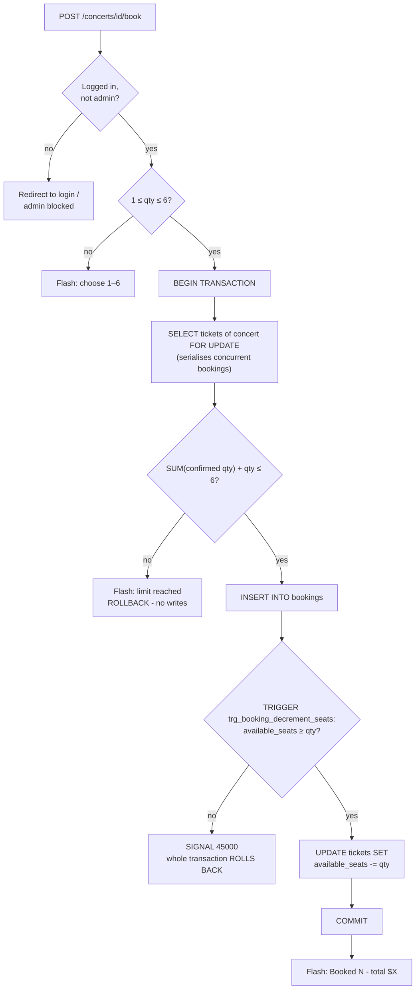
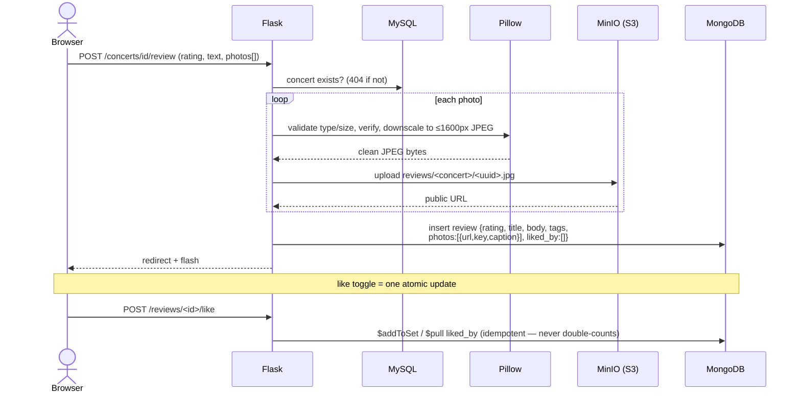
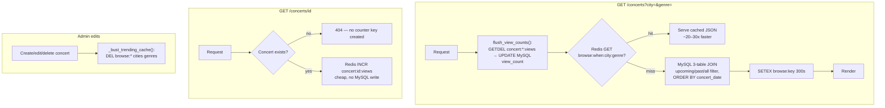
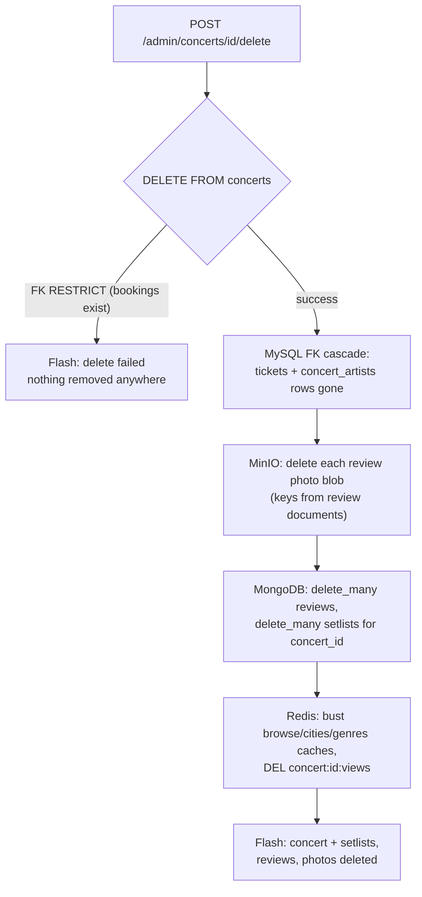
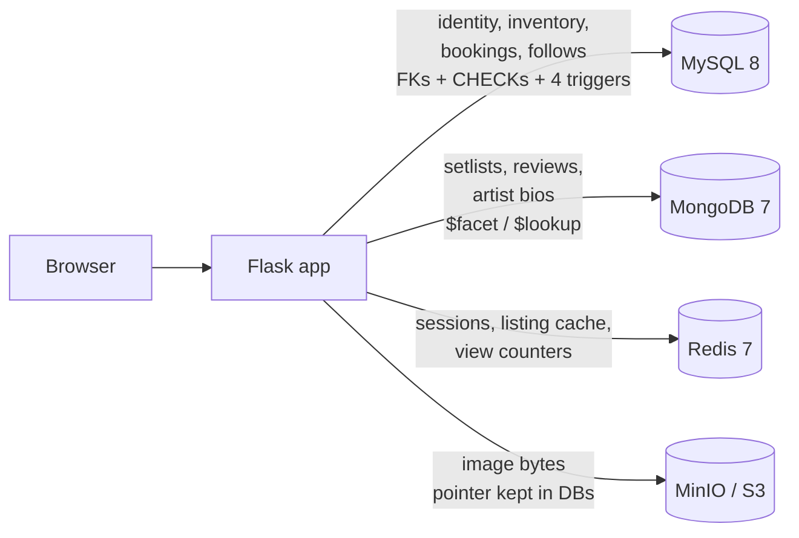

# GigTrack — Flow Diagrams (for slides & demo)

Mermaid diagrams of the key request flows, one per demo scenario. Paste into
[mermaid.live](https://mermaid.live) (or any Mermaid renderer) to export PNG/SVG
for the slides. Each diagram maps to a presenter segment in
`presentation_demo.md` and a CLI scenario in `demo_cli.md`.

---

## 1. Login & session flow — *Member E segment / Scenario A*

Redis-backed sessions with bcrypt verification and a **sliding** 30-minute
idle timeout.

```mermaid
sequenceDiagram
    actor U as Browser
    participant F as Flask
    participant M as MySQL
    participant R as Redis

    U->>F: POST /login (email, password, CSRF token)
    F->>M: SELECT user_id, password_hash, is_active WHERE email=?
    M-->>F: row
    alt account disabled
        F-->>U: "This account has been disabled."
    else bcrypt.checkpw OK
        F->>R: SETEX session:&lt;token&gt; 1800 user_id
        F-->>U: Set-Cookie (HttpOnly, SameSite=Lax) + redirect
    else wrong password
        F-->>U: "Invalid credentials"
    end

    Note over U,R: every later authenticated request
    U->>F: GET /concerts (cookie)
    F->>R: GET session:&lt;token&gt; → user_id
    F->>R: EXPIRE session:&lt;token&gt; 1800  (sliding refresh)
    F->>M: SELECT user row (incl. is_active)
```

---

## 2. Ticket booking — quota + seat trigger — *Member C segment / Scenario B*

The quota check and the INSERT run in **one locking transaction**; the
`BEFORE INSERT` trigger enforces inventory atomically and rolls back on
oversell.



---

## 3. Review with photo — pointer vs blob — *Member D segment / Scenario C*

Bytes go to object storage; both databases keep only pointers.



---

## 4. Browse caching & view counters — *Member E/F segments / Scenario D*

Cache-aside for listings; write-behind (atomic `GETDEL`) for view counts.



---

## 5. Concert delete — cross-store cascade — *Member F segment / Scenario E*

MySQL cascades via FKs; the app completes the cascade across the logical-FK
boundary into MongoDB and MinIO (no orphans).



---

## 6. Where each datastore is used (architecture recap)

`data_flow.svg` has the full sequence diagram; this is the slide-friendly
summary.


